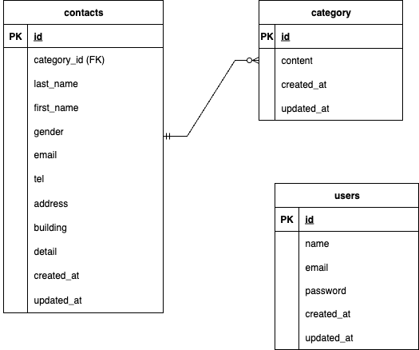

# お問合せフォーム

## 環境構築

**Dockerビルド**
Estra-Coachtechより開発環境をクローン
1. `git clone git@github.com:shino-ym/shinobu.yamaguchi-kadai1.git
2. `docker-compose up -d --build`

＊MySQLは、OSによって移動しない場合があるので、それぞれのpcに合わせてdocker-compose.ymlファイルを編集してください。

**Laravel環境構築**
1. `docker-compose exec php bash`でphpコマンド内へ
2. `composer install`で、必要なパッケージをインストールする。
3. 「.env.example」ファイルを コピーして「.env」を作成し、DBの設定を変更
　　`cp .env.example .env`を実行し、.envの中身を書き換える
DB_HOST=mysql
DB_DATABASE=laravel_db
DB_USERNAME=laravel_user
DB_PASSWORD=laravel_pass

4. アプリケーションキーの作成
php artisan key:generate
5. マイグレーションの実行をしてDBのテーブルを作成
php artisan migrate
6. シーディングの実行をしてDBのテーブルにダミーデータを投入
　（phpコマンド内）
php artisan db:seed

* the stream or file could not be openedエラーが出た場合
ディレクトリ/ファイルの情報を変更
$ sudo chmod -R 777 src/*

## 使用技術

- PHP 8.4.10
- laravel 8.75
- MySQL 8.0.36
- CSS
- HTML

## ER図

## URL
- loginフォームからスタート　http://localhost/login
- お問合せページからスタート　http://localhost

- 開発環境：http://localhost
- phpMyAdmin:：http://localhost:8080/

